  

## Links

# AI-RAN • LLM • Quantum Computing

  

<!-- <table>
  <tr>
    <td width="32%" valign="top">
      
    </td>
    <td width="32%" valign="top">
      
    </td>
    <td width="32%" valign="top">
      
    </td>
  </tr>
</table> -->

  
  
  

